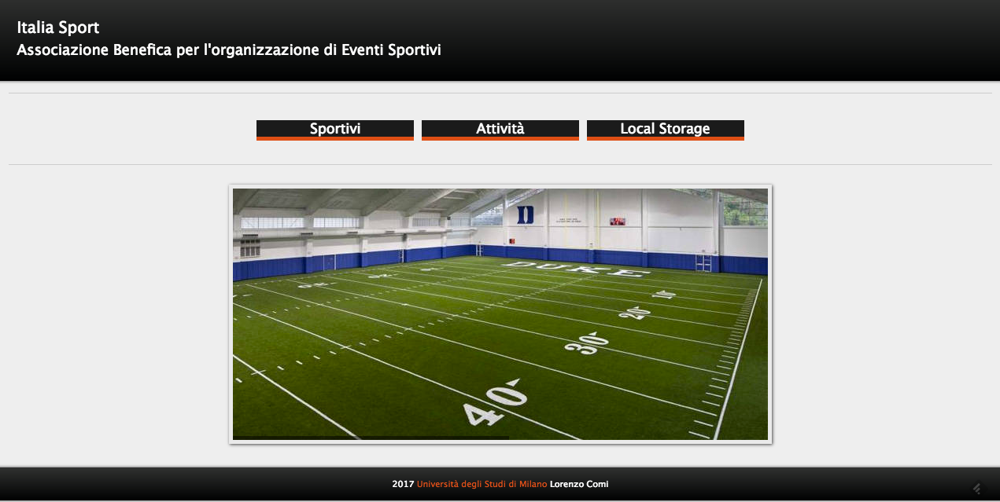
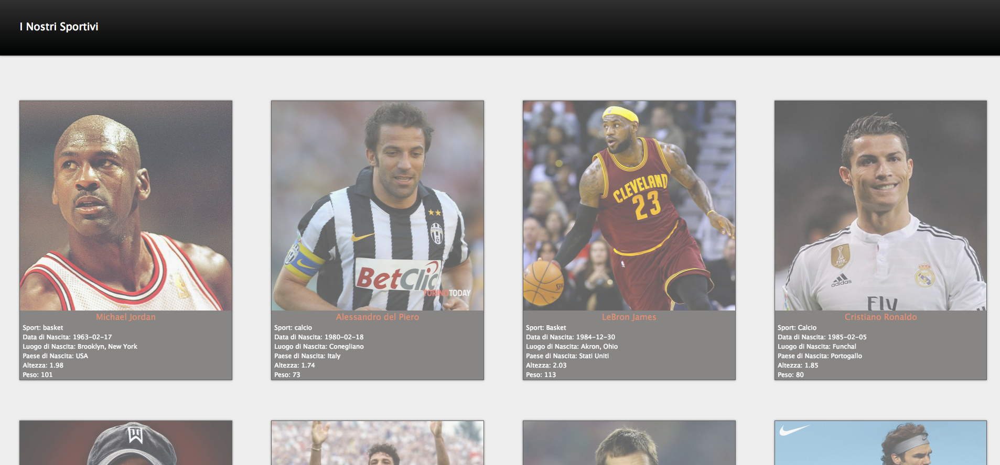
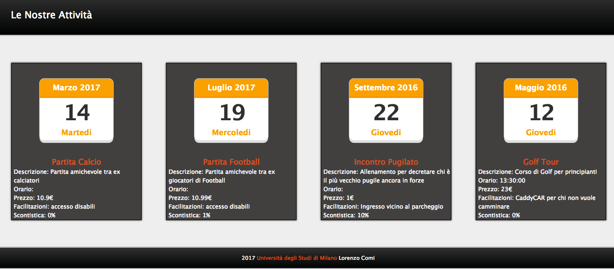
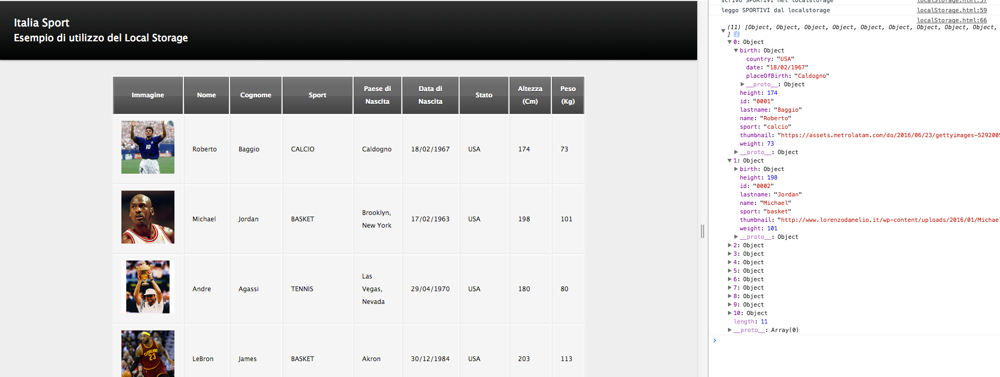

# Italia Sport
## Project Description
Il portale Italia Sport è stato sviluppato come progetto finale del corso "Applicazioni Web e Cloud" tenuto dal Prof. Claudio Ardagna @Università degli studi di Milano.
Questo progetto ha come scopo quello di esplorare ed imparare ad utilizzare le più moderne tecnologie, linguaggi e costrutti utilizzati nella programmazione di applicazioni web. Di seguito un breve elenco delle princiali tecnologie utilizzate in questo progetto:
- HTML5
- CSS3
- LocalStorage
- JavaScript
- AngularJS
- NodeJS
- Django REST Framework
- SQLite
- JSON

### Requisiti
Il progetto si pone l’obiettivo di costruire un’applicazione REST per supportare lo sviluppo dell’applicazione web per l’associazione sportiva Italia Sport; quest'ultima raggruppa un insieme di sportivi ognuno con il nome di un/a grande sportivo/sportiva.
L’applicazione deve considerare:
- Gestione degli sportivi;
- Gestione delle attività dell’Italia Sport;
- Autenticazione degli utenti.

Di seguito sono analizzate in dettaglio le caratteristiche dei macro-scenari introdotti.
Il primo scenario consiste nella gestione degli sportivi e delle attività dell’associazione sportiva giorno per giorno. Le attività sono gestite in finestre temporali di una settimana e contengono l’associazione tra sportivo, attività, e programma delle attività future. Per ogni sportivo si vogliono gestire informazioni quali altezza, peso, età, statistiche, carriera, etc.
Ogni attività contiene informazioni quali ad esempio titolo, breve descrizione, avversario, statistiche avversario, luogo e orario. In base al tipo di attività vengono associate informazioni sul prezzo, su eventuali sconti o facilitazioni. Infine, si vogliono gestire informazioni relative ai risultati e ai punteggi per ogni singola attività, incluso classifica e statistiche.

### Scelte Implementative
Per imparare ad utilizzare il maggior numero di costrutti e linguaggi, si è scelto di non utilizzare template predefiniti es. Bootstrap durante lo sviluppo della parte di front-end e di creare un portale, sicuramente non accantivante dal punto di vista grafico, ma che potesse mettere in risalto le varie tecnologie studiate durante il corso.

## Technical Details
Il backend dell'applicativo è stato realizzato utilizzando il paradigma REST (Representational state transfer) ed il linguaggio di programmazione python, sul quale, per l'appunto, si basa il Framework Django REST.

`
"REST (REpresentational State Transfer) is an architectural style to build services on top of the Web. REST simplifies interaction with a web-based system via simplified URLs, instead of complex HTTP requests."  
`

Il frontend è stato realizzato utilizzando la tecnologia AngularJS per utilizzare le API REST e l'HTML5 unito al CSS3 per gestire la grafica.

`
"AngularJS lets you extend HTML vocabulary for your application. The resulting environment is extraordinarily expressive, readable, and quick to develop."
`

### Main Features
All'interno di questo progetto ci sono delle componenti chiave, sviluppate per far apprezzare l'utilizzo di particolari linguaggi, che vanno a comporre l'intero applicativo ed il web service; in particolare ci si vuole soffermare su alcuni brani di codice che rappresentano delle caratterisitche fondamentali e particolari di questo lavoro:

- CSS3 Slider (Homepage): Grazie alla nuova tecnologia CSS3 è possibile far muovere gli elementi della pagina e creare degli slider senza utilizzare Javascript.
La direttiva utilizzata per creare l'effetto moviemnto è "@keyframes" grazie alla quale è possibile specificare in quale punto della pagina deve trovarsi un preciso elemento (una foto in questo caso). E' possibile visulizzare questa caratteristica nella HomePage del portale.

```
HTML

[...]
<li id="first" class="firstanimation">
    <a href="#">  </a>
</li>
[...]

CSS3

[...]
#slider li.firstanimation {
	-moz-animation:cycle 25s linear infinite;
	-webkit-animation:cycle 25s linear infinite;
}

@-moz-keyframes cycle {
	0%  { top:0px; }
	4%  { top:0px; }
	16% { top:0px; opacity:1; z-index:0; }
	20% { top:325px; opacity:0; z-index:0; }
	21% { top:-325px; opacity:0; z-index:-1; }
	92% { top:-325px; opacity:0; z-index:0; }
	96% { top:-325px; opacity:0; }
	100%{ top:0px; opacity:1; }

}
[...]
```

- HTML5 LocalStorage (Local Storage): il localStorage è un sistema di memorizzazione e gestione delle informazioni sul computer dell'utente (client-side) che consente di salvare all'interno del browser fino a 5 MB di dati.
Utilizzando semplici direttive javascript è possibile caricare nel local storage del browser i dati relativi agli sportivi e rileggerli in un secondo momento per includerli in una tabella.

```
[...]
<script src="/italiaSport.js"></script>
    <script>
        console.log("scrivo SPORTIVI nel localstorage");
        localStorage.setItem("sportivi", JSON.stringify(sportiviDat));
        console.log("leggo SPORTIVI dal localstorage");
        (function() {
            'use strict';

            var table, row, cell;

            var result=JSON.parse(localStorage.getItem("sportivi"));
            console.log(result);

            table = document.getElementById('table');

            for (var i = 0; i < result.length; i++) {
                // insert a new row at the end of the table
                row = table.insertRow(-1);

                cell = row.insertCell();
                cell.innerHTML = '';
[...]
```

## Final Presentation Slide
Per maggiori dettagli si faccia riferimento alle slide del progetto:
[Italia Sport Comi Lorenzo](documentazione/ComiLorenzoAWC.pdf)

## Screenshots & Video Demo
### HomePage


### Sportivi



### Attività



### Local Storage


### VIDEO Token-Based Authentication
[Authorization Token Video Demo](screenshot/AuthDemo.mov)

### VIDEO Web Site Tour
[Web Tour Video Demo](screenshot/videodemo.mov)

